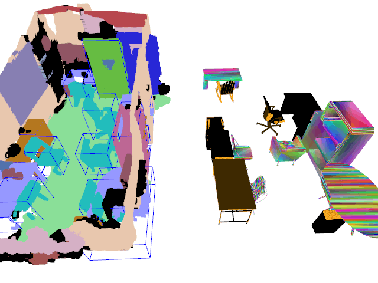
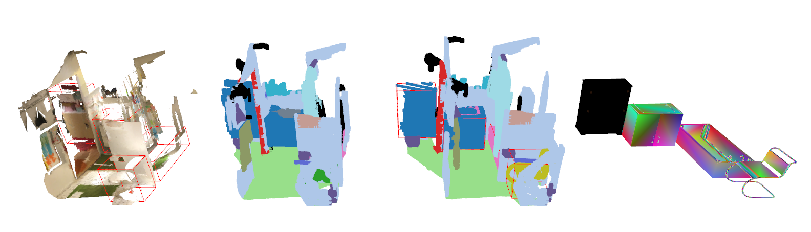

# Synthetic Object Scan Point Clouds Dataset
The [ScanNet](http://www.scan-net.org/) contains RGBD scans of indoor scenes along with annotations for semantic segmentation
and intance segmentation. In this work, we use the RGBD scans and camera trajectory of ScanNet
dataset to create synthetic point clouds of indoor environments with **accurate CAD annotations of objects**.

More specifically, we use the semantic and instance annotation of ScanNet and replace the scan point
cloud of objects in a scene with a random CAD model of the object from the same
category from the [ShapeNet](https://shapenet.org/) dataset.
In order to obtain incomplete point clouds of these synthetic objects similar to real RGBD scans, we use the
camera poses provided by ScanNet to render all the object meshes and the scene mesh into multiple views
and recreate the RGBD point cloud from these rendered views. This results in point clouds
that are incomplete and more realistic along with accurate CAD model annotations of objects. 

The dataset of point clouds of objects created as described above is called **Synthetic Object Scan Point Clouds (SOSPC)** dataset
and is shared [here](https://cloud.tugraz.at/index.php/s/gwd2ogpLcGP6n9T). In this repo, we provide scripts to read the SOSPC dataset and to create complete scenes
from these object scan point clouds by placing them in the ScanNet scenes (see below gif)

<p align="center">
 
</p>


# Usage

 ## Requirements
 The script is teseted on Python3 environment.

 ## Downloads
 * Download ShapeNetCoreV2 from [ShapeNet](https://shapenet.org/) website.
 * Download ScanNet files from [ScanNet](https://github.com/ScanNet/ScanNet) repo.
    * You only need to download the following file type from the training set of ScanNet:
        * '_vh_clean_2.0.010000.segs.json'
        * '.aggregation.json'
        * '_vh_clean_2.ply'
        * '.txt'
        * '_vh_clean_2.labels.ply'
 * Download **Synthetic Object Scan Point Clouds** dataset from [here](https://cloud.tugraz.at/index.php/s/gwd2ogpLcGP6n9T).
 
    This dataset contains partial point cloud (in .ply file) and corresponding ShapeNet CAD
    model (in .pickle file) for each object instance in the ScanNet training scenes. Please
    refer to `getScalePoseMat()` function in `createSynthScene.py` to retrieve scale+pose of
    the object.
 
 
 ## Creating Synthetic Scenes with SOSPC 
 Our SOSPC dataset
 contains partial point cloud seperately for each object in the
 training scenes of ScanNet. You need to run the below scripts to create a complete
 scene with the provided synthetic point clouds of objects.
 
 
 Update the `SHAPENETCOREV2_DIR`, `TRAIN_SCANS_DIR` and `SYNTH_DATASET_DIR` variables
 with the downloaded ShapeNet, ScanNet and Synthetic dataset paths in `createSynthScene.py`
 
 To visualize the synthetic scenes run:
 ```python
    python createSynthScene.py --visualize --nodump_dataset
```
You will see the visualization of the following scenes in an open3d window (in that order):
* RGBD scan of the scene
* Semantic segmentation of the scene provided by ScanNet
* Semantic segmentation of the created synthetic scene
* Object CAD models at their corresponding locations
<p align="center">
 
</p>

To dump the dataset with CAD model annotations and scene pointcloud run:
 ```python
    python createSynthScene.py --novisualize --dump_dataset --out_dir $OUT_DIR
```
The above command dumps the synthetic scenes dataset to the `$OUT_DIR/PCL2CAD` folder with
the following files:
* \<sceneID\>_seg.ply : Point cloud of the scene with segementation annotations as point colors
* \<sceneID\>_inst.ply : Point cloud of the scene with instance annotations as point colors
* \<sceneID\>_cad.pickle : Pickle file containing a dictionary with keys as instance
ID of the objects in the scene and values as another dictionary with following keys:
    * `catID` : ShapeNet category ID
    * `modelID` : ShapeNet model ID
    * `scale` : Scale along x,y,z axes
    * `poseMat` : A 4x4 pose matrix

    The transformed object vertices in the scene is obtained as `poseMat·diag(scale)·V` where V is
    the vertices matrix. 
    
# Citation
This dataset was developed as part of our CVPR'21 work **Monte Carlo Scene Search for 3D Scene Understanding**. Please
visit the [project page](https://www.tugraz.at/index.php?id=50484) for more info. If you find this dataset useful
consider citing us:

```
@INPROCEEDINGS{mcss2021,
title={Monte Carlo Scene Search for 3D Scene Understanding},
author={Shreyas Hampali and Sinisa Stekovic and Sayan Deb Sarkar and Chetan Srinivasa Kumar and Friedrich Fraundorfer and Vincent Lepetit},
booktitle = {CVPR},
year = {2021}
}
```